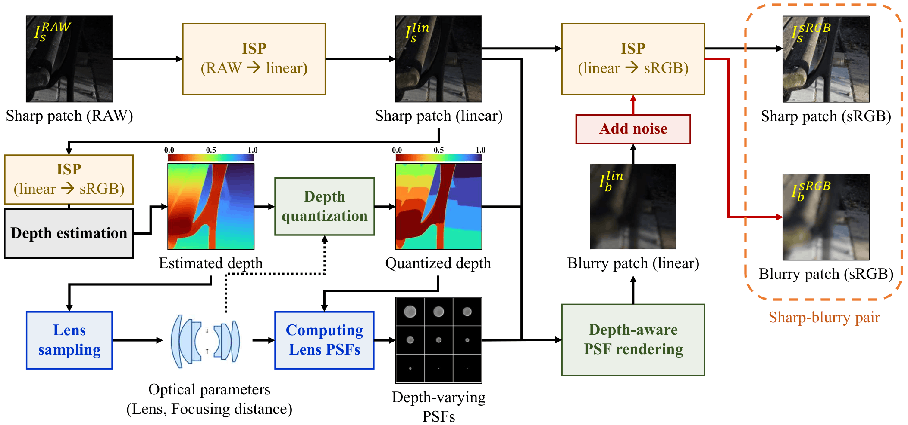

# Realistic Compound-Lens Defocus Blur Synthesis

**Links**: [Project](https://lykelee.github.io/CLDefocus/) | [arXiv](https://arxiv.org/abs/2607.05837)

**Authors**: [Yunkyu Lee](https://lykelee.github.io/) | [Woohyeok Kim](https://woo525.github.io/) | [Sunghyun Cho](https://www.scho.pe.kr/)

**Affiliation**: [POSTECH Computer Graphics Lab](https://cg.postech.ac.kr/)

---




## Abstract

Defocus blur degrades fine image structures and limits visual perception, which can adversely affect downstream vision tasks.
Although recent deep learning deblurring methods have achieved strong performance, their effectiveness depends on training data and often degrades across cameras and lenses due to limited optical diversity and realism in existing datasets.
In this paper, we propose a pipeline for **synthesizing realistic defocus deblurring datasets** for **diverse compound lenses**.
It integrates efficient wave-optics PSF computation via Debye CZT propagation, depth-aware defocus rendering with occlusion handling, and blur synthesis in the radiometrically linear space with camera ISP simulation.
This unified pipeline enables the scalable generation of photorealistic defocus datasets with diverse lens characteristics.
Using our pipeline, we generate CLDefocus, a large-scale synthetic dataset containing lens-diverse defocus image pairs.
We further analyze the limitations of real-captured defocus datasets and show that such imperfections can bias full-reference evaluation.
Extensive experiments demonstrate that models trained on CLDefocus achieve improved cross-device generalization compared to models trained on existing real and synthetic datasets.


## Installation

Clone this repository:
```bash
git clone https://github.com/lykelee/CLDefocus.git
cd CLDefocus
```

This repository consists of two components: (1) **dataset synthesis** and (2) **deblurring model training and evaluation**.
Dataset synthesis uses **JAX**, whereas deblurring models use **PyTorch**.
Installing both environments together can lead to dependency conflicts.
We therefore provide separate **Docker containers** for the two components, managed through **Docker Compose**.

Before starting the containers, create a `.env` file from the provided example:
```bash
cp .env.example .env
```
Then edit `DATA_DIR` in `.env` to the host path of your dataset root.
This directory is mounted at `/data` inside both containers.

Then, start the required containers:
```bash
# Start all containers
docker compose up -d

# Start only the dataset synthesis container
docker compose up -d datasyn

# Start only the deblurring container
docker compose up -d deblurring
```

For each task, enter the corresponding container, for example, via CLI:
```bash
docker compose exec datasyn bash
```
or via any other method (e.g., using the VSCode extension).

The containers use the **uv** package manager and provide all dependencies required to run the scripts with minimal additional setup.
After starting the containers, follow the instructions in the corresponding component README.


## Usage

### PSF Demo

PSF computation is a core component of the dataset synthesis pipeline.
We provide a standalone demo for testing the PSF computation module.

[PSF demo instructions](datasyn/psf-demo)


### Dataset Synthesis

[Dataset synthesis instructions](datasyn)


### Deblurring Models

[Deblurring model instructions](deblurring)


## Image Datasets

> [!NOTE]
> The licensing terms for redistributing **CLDefocus** are not yet confirmed.
> We have contacted the authors and are awaiting their response.
> Once the terms are clarified, we will release the dataset here.
> We apologize for the delay.
> In the meantime, you can reproduce CLDefocus yourself using our synthesis code.

[Image dataset instructions](deblurring#download-image-datasets)


## Citation

```bibtex
@article{lee2026realistic,
  title={Realistic Compound-Lens Defocus Blur Synthesis},
  author={Lee, Yunkyu and Kim, Woohyeok and Cho, Sunghyun},
  journal={arXiv preprint arXiv:2607.05837},
  year={2026}
}
```


## Contact

For questions, please contact <lyk1012@postech.ac.kr>.


## License
This repository is released under the MIT License (see [LICENSE](LICENSE)).
Third-party code, models, and data retain their original licenses; see the respective subdirectories and [Acknowledgements](#acknowledgements).


## Acknowledgements

This repository builds upon code, data, or resources from the following projects:
- [INIKNet](https://github.com/xinyao240/INIKNet), [NAFNet](https://github.com/megvii-research/NAFNet), [NRKNet](https://github.com/csZcWu/NRKNet), [Restormer](https://github.com/swz30/Restormer): deblurring model implementations
- [RSBlur](https://github.com/rimchang/RSBlur): ISP model and camera measurements
- [simple-camera-pipeline](https://github.com/AbdoKamel/simple-camera-pipeline): ISP model
- [ZERNIPAX](https://github.com/PlasmaControl/ZERNIPAX): efficient computation of Zernike polynomials
