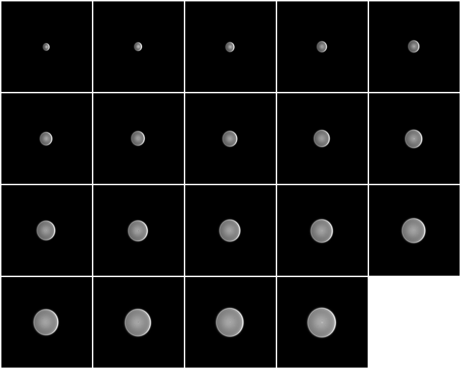
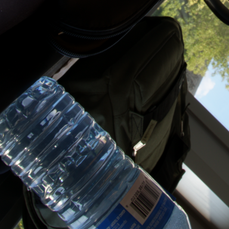

# Data Synthesis

This directory contains the code for our defocus deblurring dataset synthesis pipeline.


## Environment

Dependencies are managed with the **uv** package manager, so commands can be run directly with `uv run` (the environment is synchronized automatically on first use).
To synchronize the environment manually, run `uv sync`.

For convenience, we also support short commands via [just](https://github.com/casey/just).

Machine-specific paths are read from a `.env` file at the repository root.
Copy `.env.example` to `.env` and fill in the paths for your machine; each
section below notes which variables it uses.


## Prepare Lens Designs

We use a custom `.mytable` format, a simplified tabular representation based on the lens prescription tables commonly used in patents.

You can prepare the lens files in either of the following ways:
1. Download the preconverted `.mytable` files [here](https://drive.google.com/file/d/1SbNybWrDKmjVoVjsa468ts-6rG7bH9Y-/view?usp=drive_link) which we used to generate CLDefocus.
2. Download the original ZMX files and convert them yourself.

To acquire `.mytable` files, first visit [lens-designs.com](https://www.lens-designs.com/) and download the lens design files from the `Photographic primes` and `Photographic zooms` tabs.
The collection includes several file formats, but our converter currently supports only the ZMX format.
Put all files into one directory (nested directories are allowed) and run the following script to convert ZMX files:
```bash
uv run scripts/zemax/zmx_to_mytable.py \
    path/to/lens/zmx \
    path/to/lens/mytable
```

Finally, set the environment variable `LENS_TABLE_ROOT=path/to/lens/mytable/` in `.env`.

> [!NOTE]
> The uploaded `.mytable` files have 7 omissions (total 1,288 → 1,281) as of the first release.
> This difference is subtle, but you should still use the uploaded files if you want to exactly reproduce the original CLDefocus.


## PSF Demo

We use the **Debye CZT** for lens PSF computation.
A standalone demo is provided for testing the PSF computation module independently of the complete dataset synthesis pipeline.
You can use this after preparing lens design files.

[PSF demo instructions](psf-demo)


## Prepare Source Scenes

### Sharp RAW Images

We use the sharp RAW images from DPDD as source scenes.
To reproduce our dataset, download `Indoor CR2 RAW images` and `Outdoor CR2 RAW images` from the [official DPDD repository](https://github.com/Abdullah-Abuolaim/defocus-deblurring-dual-pixel).
Moreover, download [DPDD in PNG](https://ln2.sync.com/dl/c45358c50/r7kpybwk-xw8hhszh-qkj249ap-y8k2344d), which is used for reorganization now and for evaluation later.

The downloaded RAW files should have a structure similar to the following:
```text
download/
├── indoor/
│   ├── 1P0A0890.CR2
│   ├── ...
│   └── 1P0A2544.CR2
└── outdoor/
    ├── 1P0A0904.CR2
    ├── ...
    └── 1P0A2505.CR2
```

The synthesis pipeline expects the RAW files to be organized according to the official DPDD train, validation, and test splits.
Configure the following paths in `.env`:
- `DPDD_PNG_ROOT`: directory containing the DPDD PNG files (`dd_dp_dataset_png` from the original download)
- `DPDD_CR2_ORIGINAL_ROOT`: directory containing the downloaded CR2 files
- `DPDD_CR2_ROOT`: output directory for the reorganized CR2 view

Then run:
```bash
uv run scripts/synthesis/make_dpdd_raw_view.py \
    --png-root "${DPDD_PNG_ROOT}" \
    --src-root "${DPDD_CR2_ORIGINAL_ROOT}" \
    --dst-root "${DPDD_CR2_ROOT}"
```

The resulting directory structure under `${DPDD_CR2_ROOT}` will be:
```text
root/
├── test_c_target/
│   ├── 1P0A0916.CR2
│   ├── ...
│   └── 1P0A2520.CR2
├── train_c_target/
│   ├── 1P0A0891.CR2
│   ├── ...
│   └── 1P0A2543.CR2
└── val_c_target/
    ├── 1P0A0895.CR2
    ├── ...
    └── 1P0A2540.CR2
```


### Depth Maps

Most RAW datasets, including DPDD, do not provide ground-truth depth maps.
We therefore use depth maps generated by a monocular depth estimator, with depth values expressed in meters.

In our experiments, we used [Depth Pro](https://github.com/apple/ml-depth-pro), which is particularly strong at precise edge segmentation.
Our estimated depth maps for the DPDD scenes are available [here](https://drive.google.com/file/d/1gihYuHAbf-rDLwFIw_0VYs3KxWWnzM_Y/view?usp=drive_link).

The depth maps should follow the same split structure and file name convention as the RAW images:
```text
depth/
├── test_c_target/
│   ├── 1P0A0916.npz
│   ├── ...
│   └── 1P0A2520.npz
├── train_c_target/
│   ├── 1P0A0891.npz
│   ├── ...
│   └── 1P0A2543.npz
└── val_c_target/
    ├── 1P0A0895.npz
    ├── ...
    └── 1P0A2540.npz
```

Then set `DPDD_DEPTH_ROOT` to this depth directory in `.env`.


## Analyze Lenses

Before synthesis, the lens designs should be analyzed and filtered using the heuristic (described in Sec. 4.1 and Sec. S3.1 of the paper).
The heuristic uses several lens properties such as the total track length (TTL).

Set `LENS_ANSYS_ROOT` in `.env` to the desired output directory for the analysis results, then run:
```bash
# Using the Justfile
just analyze-lenses

# Or run the command manually
uv run scripts/synthesis/analyze_lenses.py \
    "${LENS_TABLE_ROOT}" \
    "${LENS_ANSYS_ROOT}"
```

The script creates two directories, `classify/` and `stats/`, under `${LENS_ANSYS_ROOT}`.


## Synthesize a Dataset

Before running the synthesis pipeline, make sure that the following inputs are available:
- sharp RAW source images
- corresponding metric depth maps
- lens files in the `.mytable` format
- lens-analysis results

Note that the synthesis code supports parallelization with **multiple GPUs**.
GPUs to use are decided by the environment variable `CUDA_VISIBLE_DEVICES`.
If you need to restrict it, export it or set it in the `.env` file.


### Quick Test

To verify the setup, first run the pipeline with the quick-test configuration:
```bash
# Using the Justfile
just syn-quick-test

# Or run the command manually
uv run scripts/synthesis/synthesize_dataset.py \
    --config configs/quick-test.yaml
```

The output is written to `DATASYN_QUICK_TEST`, which defaults to a temporary
directory; set it in `.env` to choose your own location.

Inspect the generated stages:
```bash
cd "${DATASYN_QUICK_TEST}"
ls

> s1_patch_crop  s2_sharpness_filter  s3_camera_choose  s4_patch_gen  s5_psf_gen  s6_blur
```

`s5_psf_gen/viz/` contains visualizations of the defocused PSFs generated for each image patch:



In this example, the PSF size varies smoothly with scene depth (described in Sec. 4.3 of the paper).

The final synthesized images are saved to `s6_blur/`.
Blurred inputs and sharp targets are stored in `s6_blur/input/` and `s6_blur/target/`, respectively.
Corresponding input and target images share the same filename.

An example of generated pairs is shown below:

| Input | Target |
|:-----:|:------:|
|  |  |


### Reproduce CLDefocus

> [!WARNING]
> This would require large storage.
> For the case of train split, it needs approximately **90 GB** free space.
> We might refactor the code to reduce the required maximum space in the future.

Make sure that you prepared all the inputs described above.
As mentioned previously, you should use the uploaded mytable files if you want to exactly reproduce CLDefocus.
(If not, it would not matter.)

CLDefocus is generated one split at a time.
Set `DATASYN_CLDEFOCUS_KIND` to the split you want to generate (`train`, `val`, or `test`) and `DATASYN_CLDEFOCUS_ROOT` to its output directory in `.env`.
Then run the pipeline with the CLDefocus configuration:
```bash
# Using the Justfile
just syn-cldefocus

# Or run the command manually
uv run scripts/synthesis/synthesize_dataset.py \
    --config configs/cldefocus.yaml
```

This would take a long time.
Our pipeline is **resumable**, so you can stop and continue it later.


### Generate Your Own Datasets

The synthesis configuration allows you to customize parameters such as:
- sharp RAW source images
- lens collections
- number of generated pairs
- patch resolution

By preserving the required directory structures and file formats, you can use the pipeline to generate custom datasets.
Make your own configuration file and run:
```bash
# Using the Justfile
just syn path/to/config.yaml

# Or run the command manually
uv run scripts/synthesis/synthesize_dataset.py \
    --config path/to/config.yaml
```
