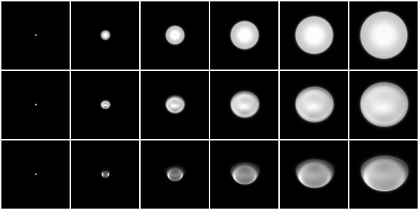
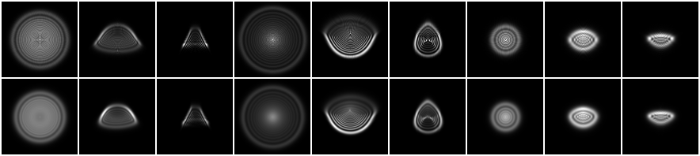

# PSF Demo

This is a demo for PSF computation using the **Debye CZT**.
It can also be used independently of the dataset synthesis to study the PSFs of diverse compound lenses.


## Setup

Set the environment variable `LENS_TABLE_ROOT` to the directory containing lens designs in the `.mytable` format in the `datasyn/.env`:
```bash
LENS_TABLE_ROOT=path/to/lens/mytable/
```

All commands below assume the current directory is this `psf-demo` directory.


## Quick Test

To verify the setup, run:
```bash
# Using the Justfile
just quick-test

# Or run the command manually
uv run compute_psfs.py  --lens-root ${LENS_TABLE_ROOT}  --config configs/quick-test.json  --out out/quick-test
```

Then the following image is saved to `out/quick-test/image/prime/JP2018-205527_Example01P.png`:




## Test for Various Lenses

To generate PSFs for multiple lens designs, run:
```bash
# Using the Justfile
just many-lenses

# Or run the command manually
uv run compute_psfs.py  --lens-root ${LENS_TABLE_ROOT}  --config configs/many-lenses.json  --out out/many-lenses
```

The generated visualizations are saved to `out/many-lenses/image/`.


## Compare with Zemax

Zemax provides **Huygens PSF** to compute PSFs accurately based on Huygens principle.
By slightly moving the image surface from the focal plane, we can obtain PSFs for various defocus values.

In the Zemax student edition available to us, we could not find a way to compute and export PSFs automatically.
We therefore exported each PSF manually as a `.txt` file through the GUI and converted the files to `.npz` using [this script](../scripts/zemax/zemax_psf_txt_to_npz.py).
A few exported PSFs are provided [here](zemax).
All PSFs were generated by shifting the image surface by $0.2 \, \text{mm}$ and evaluating all field points defined in each lens design.

For a consistent comparison, we configure our Debye CZT implementation to match the corresponding Zemax settings.
To obtain the comparison result, run:
```bash
# Using the Justfile
just compare-with-zemax

# Or run the command manually

# Generate PSFs
uv run compute_psfs.py  --lens-root ${LENS_TABLE_ROOT}  --config configs/compare-with-zemax.json  --out out/compare-with-zemax
# Make a plot for a few PSFs
uv run compare_with_zemax.py  --psf-npz-root out/compare-with-zemax/npz  --out out/compare-with-zemax.png
```

Then you will get the following image at `out/compare-with-zemax.png`:



The first row shows the Zemax results, and the second row shows the corresponding results from our Debye CZT implementation.


## Test on Your Own Lenses

You probably have other lens design files in the ZMX format.
As explained in the [data synthesis](../), convert the ZMX files to the `.mytable` format, then create a configuration file based on one of the provided examples and run `compute_psfs.py`.

The simulator is intended primarily for conventional photographic lens designs, and it is likely to work fine for those.
However, it may become less accurate or unstable at severe off-axis field positions or for lenses with high NA.
